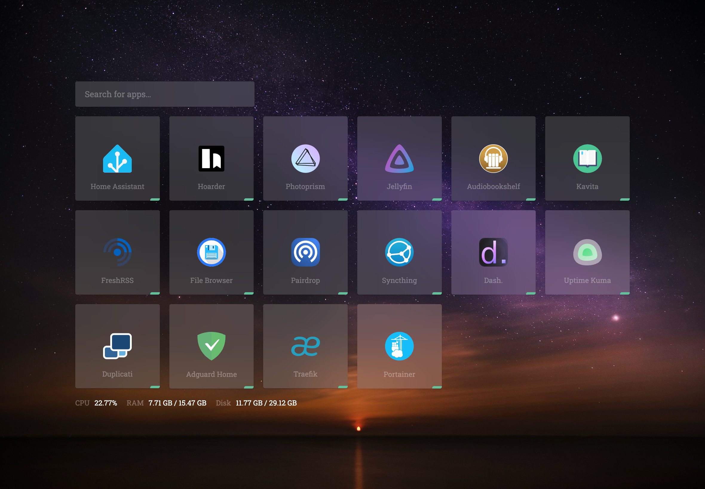
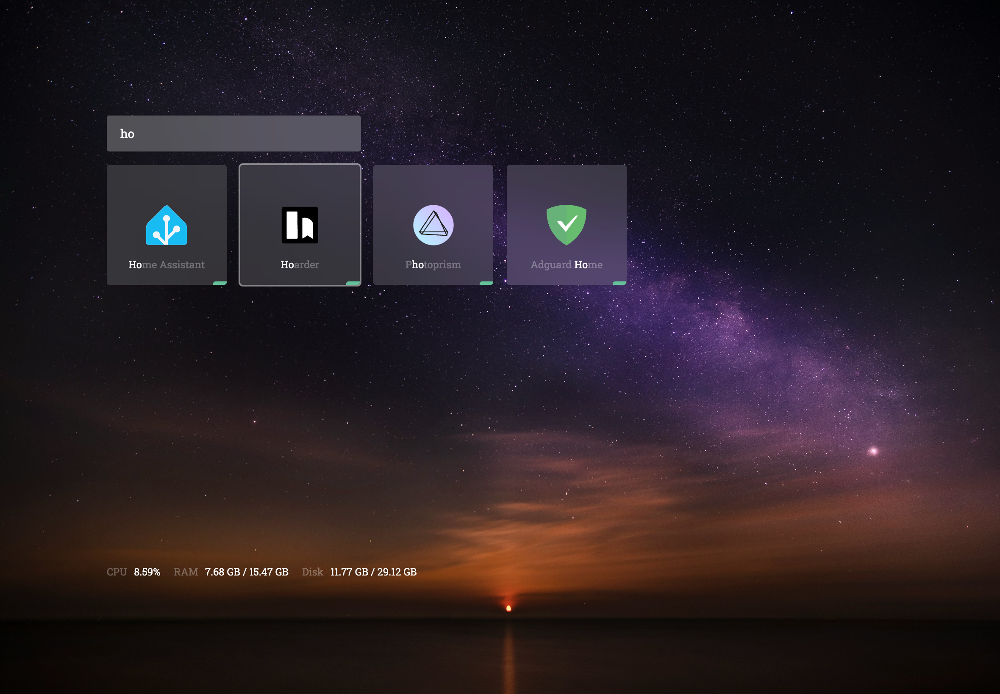

# Dashboard

A dashboard for homelab with auto-discovery of [Docker](https://www.docker.com/) containers and [Traefik](https://traefik.io/) domains.





Wallpaper by [Unsplash](https://unsplash.com/photos/the-night-sky-is-filled-with-stars-above-the-ocean--Qi1aO87fP4).

## Installation

The app can be installed using [Docker](https://www.docker.com/) or by running the app directly.

Sample `docker-compose.yml`:

```yaml
name: dashboard
services:
  dashboard:
    container_name: dashboard
    image: ghcr.io/satya164/home-dashboard:main
    ports:
      - 3096:3096
    volumes:
      - /var/run/docker.sock:/var/run/docker.sock:ro
      - /proc:/host/proc:ro
      - /:/host/rootfs:ro,rslave
      - ./config:/app/config
      - ./public/icons:/app/public/icons
      - ./public/wallpapers:/app/public/wallpapers
    restart: unless-stopped
```

Make sure to replace `./config`, `./public/icons`, and `./public/wallpapers` with the path to the directories where the configuration and assets are stored.

The following volume mounts are needed for full functionality:

- `/var/run/docker.sock` — to discover running containers and their status
- `/proc` → `/host/proc` — host CPU and RAM metrics
- `/` → `/host/rootfs` — host disk usage

## Configuration

Configuration is done by placing a `config.yml` file in the `config` directory.

Docker containers are discovered and displayed automatically. Additionally, Traefik API URL is necessary to URLs for containers with published domains:

```yaml
traefik:
  url: http://your-traefik-host:8080
```

In addition to auto-discovery, you can also add custom entries and overrides for specific containers with the `apps` key:

```yaml
apps:
  - container: home-assistant
    name: Home Assistant
    icon: home-assistant.svg
    url: https://assistant.mydomain.com
```

The following configuration keys are supported:

- `container`: Docker container name - if specified, keys below will override auto-discovered values for that container.
- `name`: Friendly label to display
- `icon`: Icon filename stored under `public/icons`. Missing icons are downloaded from [homarr-labs/dashboard-icons](https://github.com/homarr-labs/dashboard-icons) automatically.
- `url`: URL to open when the tile is clicked.
- `request`: Optional configuration for making a custom request to determine the status of the app. If not specified, container status is used.
  - `method`: HTTP method (default: `GET`)
  - `status_codes`: Array of status codes that indicate the app is up (defaults to any 2xx code)

The `ignore` key can be used to hide specific containers from the dashboard:

```yaml
ignore:
  - vpn-gateway
  - legacy-service
```

The `wallpaper` key can be used to set a custom wallpaper for the dashboard:

```yaml
wallpaper:
  url: https://example.com/wallpaper.jpg
```

You can also reference local wallpaper files stored under `public/wallpapers`:

```yaml
wallpaper:
  file: night-sky.jpg
```

Sample `config.yml`:

```yaml
apps:
  - container: home-assistant
    name: Home Assistant
    icon: home-assistant.svg
    url: https://assistant.mydomain.com
  - container: jellyfin
    name: Jellyfin
    icon: jellyfin.svg
    url: https://jellyfin.mydomain.com
  - name: Syncthing
    icon: syncthing.svg
    url: https://syncthing.mydomain.com

ignore:
  - vpn-gateway
  - legacy-service

traefik:
  url: http://192.168.0.100:8080

wallpaper:
  file: night-sky.jpg
```

## Development

Install dependencies:

```bash
npm install
```

Copy the sample config file from the [Configuration](#configuration) section to `config/config.yml`.

Run the app:

```bash
npm run dev
```

To build the Docker image:

```bash
docker build . -t ghcr.io/satya164/home-dashboard:main
```

Or with Podman:

```bash
podman build . -t ghcr.io/satya164/home-dashboard:main
```

To run the Docker image:

```bash
docker run -p 3096:3096 \
  -v ./config:/app/config \
  -v ./public/icons:/app/public/icons \
  -v ./public/wallpapers:/app/public/wallpapers \
  -v /var/run/docker.sock:/var/run/docker.sock:ro \
  -v /proc:/host/proc:ro \
  -v /:/host/rootfs:ro,rslave \
  ghcr.io/satya164/home-dashboard:main
```

Or with Podman:

```bash
podman run -p 3096:3096 \
  -v ./config:/app/config \
  -v ./public/icons:/app/public/icons \
  -v ./public/wallpapers:/app/public/wallpapers \
  -v /run/podman/podman.sock:/var/run/docker.sock:ro \
  -v /proc:/host/proc:ro \
  -v /:/host/rootfs:ro,rslave \
  ghcr.io/satya164/home-dashboard:main
```
